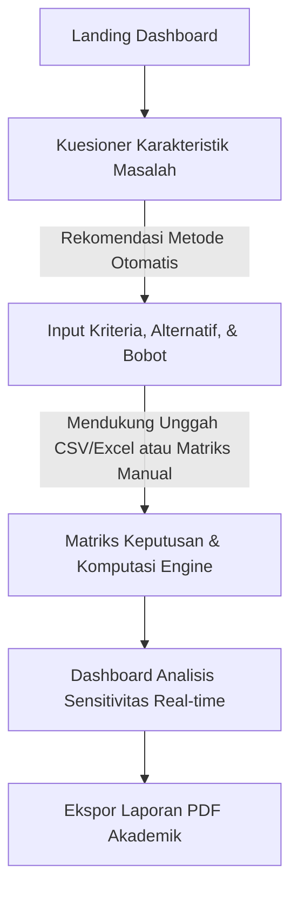

# Blueprint Proyek DSS (Sistem Pendukung Keputusan)

Sistem Pendukung Keputusan (DSS) ini dirancang khusus untuk memenuhi tugas mata kuliah Teori Pengambilan Keputusan. Sistem ini memandu pengguna melalui analisis karakteristik masalah hingga rekomendasi metode Multi-Criteria Decision Making (MCDM) otomatis, penyusunan kriteria dan alternatif (mendukung input manual maupun unggah berkas CSV/Excel), komputasi matriks keputusan dengan berbagai metode (SAW, TOPSIS, AHP), analisis sensitivitas interaktif secara real-time, dan ekspor laporan akademik dalam format PDF.

Sistem juga menyediakan dataset bawaan (`laptop_price - dataset.csv`) sebagai contoh siap pakai untuk mempermudah demonstrasi pemilihan laptop terbaik berdasarkan kriteria teknis dan harga.

---

## 1. Alur Kerja Sistem (System Workflow)



---

## 2. Software Requirements Specification (SRS)

### 2.1 Aturan Validasi Sistem (System Validation Rules)
* **Validasi Matriks Keputusan:**
  * Sistem wajib menolak input nilai negatif untuk kriteria bertipe *benefit* (keuntungan).
  * Sistem harus menghentikan kalkulasi dan menampilkan pesan galat jika terdapat nilai $0$ (nol) pada elemen pembagi saat proses transformasi/normalisasi matriks (untuk menghindari interupsi *Division by Zero*).
* **Validasi Konsistensi Analisis Hierarki Proses (AHP):**
  * Jika pengguna menggunakan metode AHP untuk pembobotan, sistem wajib menghitung nilai *Eigenvector*, *Principal Eigenvalue* ($\lambda_{max}$), *Consistency Index* (CI), dan *Consistency Ratio* (CR).
  * Batas toleransi nilai $CR$ adalah $\le 0.1$. Jika $CR > 0.1$, sistem secara otomatis mengunci fitur kalkulasi alternatif dan menampilkan notifikasi: *"Matriks Perbandingan Berpasangan Tidak Konsisten. Harap tinjau kembali nilai preferensi kriteria Anda."*
* **Validasi Berkas Masukan (File Upload):**
  * Format file yang diizinkan adalah `.csv`, `.xls`, dan `.xlsx`.
  * Ukuran maksimum file dibatasi sebesar 5 Megabytes (MB).
  * Sistem menyediakan pilihan pemetaan kolom otomatis jika pengguna mengunggah dataset (seperti dataset harga laptop yang disediakan).

### 2.2 Perilaku Dinamis Sistem (System Behavioral Specifications)
* **Real-time Chart Re-rendering:**
  * Pada halaman analisis sensitivitas, perubahan nilai komponen *slider* bobot kriteria harus memicu perhitungan ulang matriks di sisi klien dan memperbarui grafik batang peringkat alternatif secara instan dengan latensi kurang dari 100 milidetik ($< 100\text{ms}$).
* **State Retention & Auto-save:**
  * Guna mencegah kehilangan data akibat kegagalan koneksi atau penutupan *tab* browser secara tidak sengaja, sistem wajib menyimpan status pengerjaan matriks terakhir ke dalam *Local Storage* pengguna secara berkala (interval 5 detik).

### 2.3 Aturan Bisnis Aplikasi (Application Business Rules)
* **Normalisasi Bobot Otomatis:**
  * Total akumulasi bobot ($W$) dari seluruh kriteria yang didefinisikan wajib bernilai tepat sama dengan $1.0$ (atau $100\%$).
  * Rumus pembatasan: $\sum_{j=1}^{n} w_j = 1$
  * Jika input manual pengguna tidak memenuhi syarat tersebut, sistem akan menampilkan dialog konfirmasi untuk melakukan normalisasi proporsional otomatis menggunakan formula:
    $$w_j^{\text{new}} = \frac{w_j}{\sum_{i=1}^{n} w_i}$$

---

## 3. System Design Document (SDD)

### 3.1 Arsitektur Sistem (Decoupled Micro-Architecture)
Sistem menggunakan pola arsitektur *Decoupled Client-Server* untuk mengisolasi beban komputasi statistik di sisi backend dan memastikan antarmuka frontend tetap responsif. Proyek ini menggunakan **SQLite** sebagai database relasional lokal yang ringan dan portabel agar mudah dijalankan tanpa instalasi database server eksternal yang rumit.

* **Frontend Layer:** React.js dikombinasikan dengan Vite sebagai *build tool* berkecepatan tinggi. Desain antarmuka menggunakan **Vanilla CSS** dengan custom properties untuk estetika *warm minimalist* yang nyaman di mata.
* **Backend Layer:** FastAPI (Python) dengan dukungan NumPy & Pandas untuk komputasi MCDM yang cepat dan parsing berkas CSV/Excel.
* **Database Layer:** SQLite sebagai database relasional lokal (`dss_database.db`) yang terintegrasi menggunakan SQLAlchemy ORM.

```
┌─────────────────────────────────┐         ┌─────────────────────────────────┐
│         Client Browser          │         │       FastAPI Core Engine       │
│  (React.js / Plus Jakarta Sans) │ ◄─────► │     (NumPy / Pandas Solver)     │
│         (Vanilla CSS)           │  JSON   │         (SQLAlchemy ORM)        │
└─────────────────────────────────┘   API   └─────────────────────────────────┘
                                                             │
                                                             ▼
                                            ┌─────────────────────────────────┐
                                            │      SQLite Database File       │
                                            │       (dss_database.db)         │
                                            └─────────────────────────────────┘
```

### 3.2 Skema Database Relasional (SQLite DDL Specification)

```sql
-- 1. Tabel Utama Proyek DSS
CREATE TABLE projects (
    id TEXT PRIMARY KEY, -- Menggunakan UUID string
    title VARCHAR(100) NOT NULL,
    chosen_method VARCHAR(20),
    created_at TIMESTAMP DEFAULT CURRENT_TIMESTAMP,
    updated_at TIMESTAMP DEFAULT CURRENT_TIMESTAMP
);

-- 2. Tabel Dimensi Kriteria
CREATE TABLE criterias (
    id TEXT PRIMARY KEY, -- Menggunakan UUID string
    project_id TEXT REFERENCES projects(id) ON DELETE CASCADE,
    name VARCHAR(50) NOT NULL,
    weight NUMERIC(4,3) NOT NULL CHECK (weight >= 0 AND weight <= 1),
    type VARCHAR(7) NOT NULL CHECK (type IN ('benefit', 'cost'))
);

-- 3. Tabel Dimensi Alternatif
CREATE TABLE alternatives (
    id TEXT PRIMARY KEY, -- Menggunakan UUID string
    project_id TEXT REFERENCES projects(id) ON DELETE CASCADE,
    name VARCHAR(100) NOT NULL
);

-- 4. Tabel Fakta Matriks Keputusan
CREATE TABLE matrix_values (
    id INTEGER PRIMARY KEY AUTOINCREMENT,
    project_id TEXT REFERENCES projects(id) ON DELETE CASCADE,
    criteria_id TEXT REFERENCES criterias(id) ON DELETE CASCADE,
    alternative_id TEXT REFERENCES alternatives(id) ON DELETE CASCADE,
    value NUMERIC(12,4) NOT NULL,
    UNIQUE (project_id, criteria_id, alternative_id)
);
```

### 3.3 Arsitektur Endpoint RESTful API (v1 Specification)

| Method | Endpoint | Payload (JSON) | Deskripsi |
| :---- | :---- | :---- | :---- |
| POST | `/api/v1/projects` | `{"title": "Analisis Alternatif"}` | Menginisialisasi entitas proyek DSS baru. |
| GET | `/api/v1/projects` | - | Mengambil daftar seluruh proyek DSS. |
| GET | `/api/v1/projects/{id}` | - | Mengambil detail lengkap proyek beserta kriteria, alternatif, dan nilai matriks. |
| POST | `/api/v1/projects/{id}/setup` | `{"criterias": [...], "alternatives": [...], "matrix": [...]}` | Menyimpan konfigurasi awal kriteria, alternatif, dan nilai matriks. |
| POST | `/api/v1/projects/import-csv` | Form Data (file) | Membaca file CSV/Excel dan mengembalikan struktur kolom & sampel data untuk dipetakan. |
| POST | `/api/v1/solver/validate` | `{"matrix": [[...]], "weights": [...], "criterias_types": [...]}` | Memeriksa kelayakan operasi matriks dan konsistensi AHP. |
| POST | `/api/v1/solver/calculate` | `{"project_id": "uuid", "method": "TOPSIS"}` | Mengeksekusi algoritma MCDM lengkap dan mengembalikan hasil skor. |
| POST | `/api/v1/solver/sensitivity` | `{"project_id": "uuid", "modified_weights": [...]}` | Menghitung ulang urutan preferensi alternatif secara cepat. |
| GET | `/api/v1/projects/{id}/report` | - | Mengunduh berkas laporan akademik PDF. |

### 3.4 Struktur Direktori Backend (Clean Architecture)

```
backend/
├── app/
│   ├── core/
│   │   ├── config.py          # Konfigurasi Environment & SQLite Connection
│   │   └── security.py        # Pengamanan Sistem & CORS Policy
│   ├── api/
│   │   ├── endpoints/
│   │   │   ├── projects.py    # Route Management Proyek & Setup & CSV Import
│   │   │   └── solver.py      # Route Komputasi Teori Keputusan (SAW, TOPSIS, AHP)
│   │   └── router.py          # Master API Router Aggregator
│   ├── schemas/
│   │   ├── project.py         # Skema Validasi Pydantic untuk Proyek & Setup
│   │   └── matrix.py          # Validasi Struktur Matriks Keputusan & AHP
│   ├── services/
│   │   ├── ahp.py             # Engine Kalkulasi Judgement Matrix & CR AHP
│   │   ├── topsis.py          # Engine Normalisasi Bobot Terbobot & Jarak Ideal TOPSIS
│   │   ├── saw.py             # Engine Simple Additive Weighting (SAW)
│   │   └── pdf_generator.py   # Engine Generator PDF Akademik (ReportLab)
│   ├── models/
│   │   └── database.py        # Pemetaan Objek ORM SQLAlchemy (SQLite)
│   └── main.py                # Titik Masuk FastAPI (FastAPI App & Server)
├── requirements.txt           # Dependensi Backend (fastapi, uvicorn, sqlalchemy, numpy, pandas, reportlab, openpyxl, python-multipart)
└── dss_database.db            # SQLite Database File (akan dibuat otomatis)
```

---

## 4. Antarmuka Pengguna & Spesifikasi Alur UI/UX

### 4.1 Desain Kelas Dunia: Warm Minimalist & Professional
Desain antarmuka dikembangkan untuk menonjolkan keindahan fungsional dengan pendekatan minimalis, hangat, dan profesional. Menghindari warna hitam-putih murni dan menggunakan warna bumi hangat (*warm earthy tones*) untuk mengurangi kelelahan mata.

* **Tipografi:** Menggunakan font tunggal **Plus Jakarta Sans** (diimpor dari Google Fonts).
  * Ukuran Header Utama: `24px` / `Bold` / `tracking: -0.02em`
  * Ukuran Sub-header: `16px` / `SemiBold` / `tracking: -0.01em`
  * Ukuran Body Text: `14px` / `Regular` / `leading: 1.6`
  * Ukuran Caption/Metadata: `12px` / `Medium`
* **Palet Warna Hangat (Warm Earthy Palette):**
  * `Canvas Background`: `#FAF6F0` (Ivory/Cream hangat).
  * `Card/Panel Background`: `#FFFFFF` (Putih bersih dengan border tipis `#EFEAE2` dan bayangan lembut `box-shadow: 0 10px 30px -15px rgba(139, 94, 60, 0.08)`).
  * `Primary Text`: `#3E362E` (Deep Bronze / Warm Charcoal).
  * `Secondary Text`: `#7C7267` (Earthy Gray).
  * `Accent/Primary Interactive`: `#D37B55` (Burnt Terracotta / Soft Copper).
  * `Accent Hover/Active`: `#B9633E` (Terracotta gelap).
  * `Accent Muted`: `#EADCD3` (Terracotta ultra-soft untuk badge/highlight).
  * `Success State (Benefit)`: `#7A9D54` (Olive Green lembut).
  * `Danger State (Cost)`: `#C85C5C` (Soft Rust Red).
* **Tata Letak & Interaksi:**
  * Layout berbasis kartu dengan padding luas (`gap: 24px` dan `padding: 32px`).
  * Transisi super halus (`transition: all 0.3s cubic-bezier(0.4, 0, 0.2, 1)`) pada setiap tombol, hover baris tabel, dan pergerakan slider.
  * Hasil visualisasi data diperbarui secara asinkronus tanpa kedipan layar (*flicker-free*).

### 4.2 Representasi Maket Antarmuka Terstruktur

```
+-----------------------------------------------------------------------------------------+
|  DSS Dashboard // Sistem Pendukung Keputusan TPK                     [ Project: TA_MCDM ]|
+-----------------------------------------------------------------------------------------+
|  [1] Karakteristik  >  [2] Matriks & Kriteria  >  [3] Analisis Sensitivitas  >  [4] Hasil |
+-----------------------------------------------------------------------------------------+
|                                                                                         |
|  Kriteria & Manajemen Bobot Dinamis                 Visualisasi Peringkat (TOPSIS Engine)|
|  ──────────────────────────────────                 ─────────────────────────────────────|
|  Geser slider untuk simulasi bobot kriteria         [ Rank 1 ] Alternatif C       (0.876)|
|  secara real-time terhadap peringkat akhir.         ██████████████████████████████        |
|                                                                                         |
|  C1: Biaya (Cost)                                   [ Rank 2 ] Alternatif A       (0.642)|
|  [─────○───────────────────────────────] 15%        ████████████████████                  |
|                                                                                         |
|  C2: Kualitas (Benefit)                             [ Rank 3 ] Alternatif B       (0.311)|
|  [───────────────────────────────○─────] 60%        ██████████                            |
|                                                                                         |
|  C3: Fleksibilitas (Benefit)                                                            |
|  [───────────────○─────────────────────] 25%        [ Unduh Laporan PDF Akademik (.pdf) ] |
|                                                                                         |
+-----------------------------------------------------------------------------------------+
```

---

## 5. Rencana Pengembangan (Sprint Methodology)

### 5.1 Sprint 1: Fondasi Backend & Engine MCDM (Minggu 1)
* Menginisialisasi proyek backend FastAPI dan database SQLite.
* Membuat modul komputasi matematika (`saw.py`, `topsis.py`, dan `ahp.py`).
* Menguji modul komputasi dengan data pengujian standar untuk memastikan akurasi matematis.

### 5.2 Sprint 2: Frontend Modern (Vanilla CSS) & Integrasi API (Minggu 2)
* Menginisialisasi aplikasi React dengan Vite.
* Membuat sistem styling Vanilla CSS dengan menyusun file `index.css` bertema warna hangat.
* Membuat form wizard: (1) Kuesioner Rekomendasi, (2) Input Kriteria & Alternatif (dengan opsi unggah CSV dan parsing otomatis dataset harga laptop), (3) Input Matriks.
* Menghubungkan frontend ke API backend untuk validasi matriks, perhitungan AHP (CR), dan hasil awal SAW/TOPSIS.

### 5.3 Sprint 3: Analisis Sensitivitas Real-time, Ekspor PDF & Finalisasi (Minggu 3)
* Membuat halaman Analisis Sensitivitas interaktif dengan slider bobot dinamis yang terhubung ke grafik visual (menggunakan SVG native).
* Mengembangkan fitur unduh laporan PDF akademik di sisi backend menggunakan pustaka Python `reportlab`.
* Melakukan integrasi menyeluruh, penanganan *auto-save* ke *local storage*, dan uji coba secara komprehensif.
